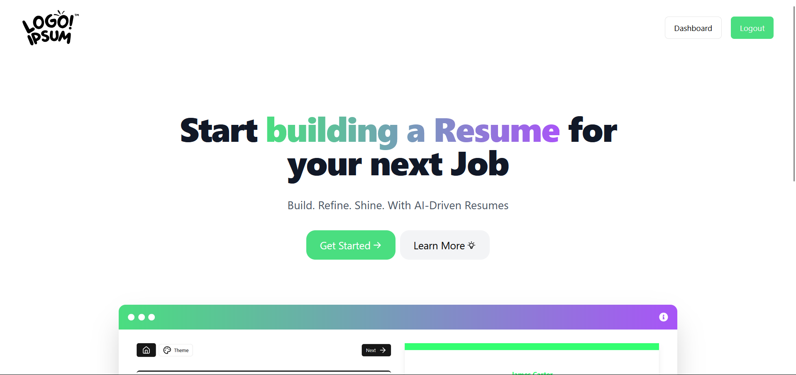
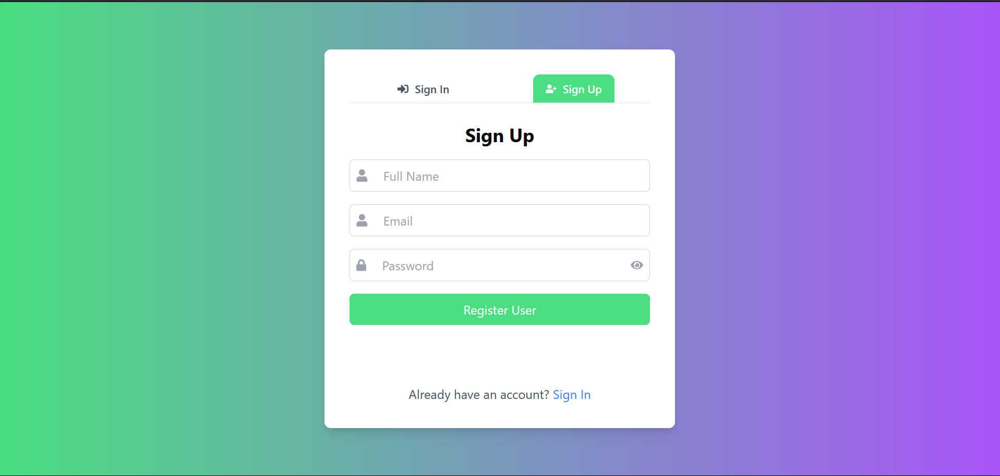
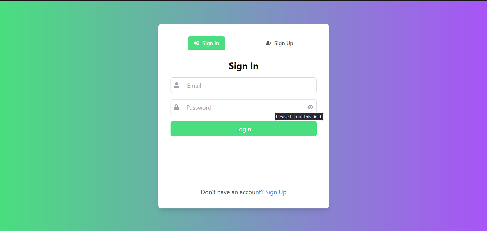
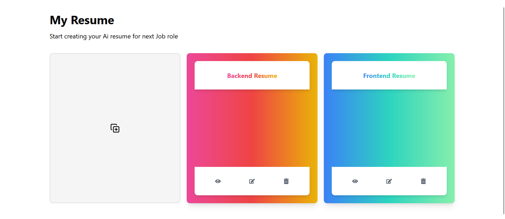
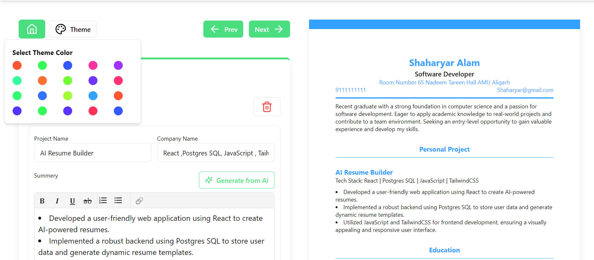
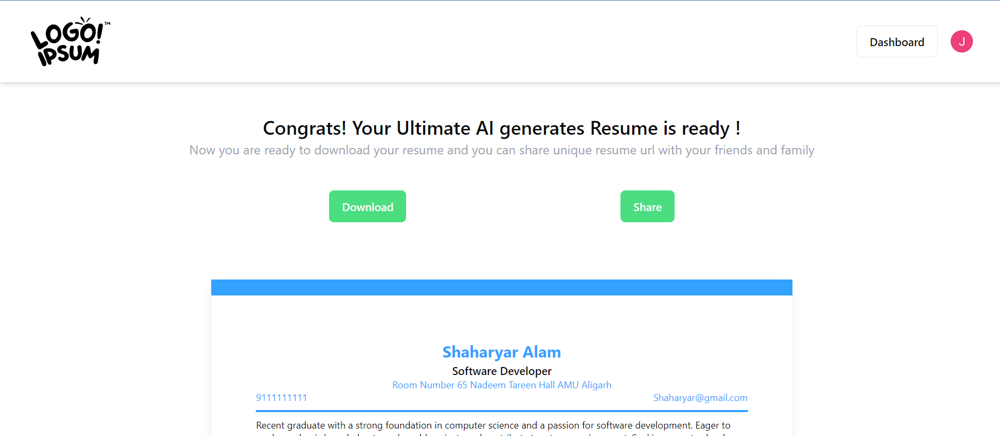

# AI Resume Builder

AI Resume Builder is a sophisticated web application that leverages artificial intelligence to help users craft professional resumes. The application features an intuitive interface and robust backend services for secure data management.

## 📌 Index  

- [Tech Stack](#tech-stack)  
- [Demo](#demo)  
- [Installation](#installation)  
  - [Setup with Docker](#setup-with-docker)  
  - [Setup without Docker](#setup-without-docker)  
- [Features](#features)  
- [Contribution](#contribution)  
- [Developers](#developers)  

---

## Tech Stack

- **Frontend:** React.js, TailwindCSS, Redux Toolkit  
- **Backend:** Node.js, Express.js, Docker  
- **Database:** MongoDB  

## Demo

🔗 Watch a demonstration on [YouTube](https://youtu.be/IBdpMBvtZhU)  

🌐 Live demo: [AI Resume Builder](https://main--ai-resume-builder-07.netlify.app/)  



---
## Installation

To run AI Resume Builder locally, follow these steps:

### 1️⃣ Clone the Repository

```bash
git clone https://github.com/ANSHU-1908/AI-reusme-Builder.git
cd AI-reusme-Builder
```

### 2️⃣ Create Environment Files  

Before proceeding, create the necessary environment files for **both frontend and backend**.

#### 🔹 Backend (`Backend/.env`)  

Create a `.env` file inside the `Backend/` directory and add the following:  

```plaintext
MONGODB_URI={Your MongoDB URI} # If using Docker: mongodb://mongodb:27017/ai-resume-builder
PORT=5001
JWT_SECRET_KEY={Your Secret Key} #example "secret"
JWT_SECRET_EXPIRES_IN="1d"
NODE_ENV=Dev
ALLOWED_SITE=http://localhost:5173
```

#### 🔹 Frontend (`Frontend/.env.local`)  

Create a `.env.local` file inside the `Frontend/` directory and add the following:  

```plaintext
VITE_GEMENI_API_KEY={Your Gemini API Key}
VITE_APP_URL=http://localhost:5001/
```

### 3️⃣ Choose a Setup Method  

Now, you can **choose** to set up the project **with or without Docker**.

---

### 🚀 Setup with Docker

1. Navigate to the backend directory:
    ```bash
    cd Backend/
    ```

2. Run the Docker Compose file:
    ```bash
    docker-compose up -d
    ```

3. Start the frontend server:
    ```bash
    cd ../Frontend/
    npm install
    npm run dev
    ```

---

### 🔧 Setup without Docker

#### **Frontend Setup**

1. Navigate to the frontend directory and install dependencies:
    ```bash
    cd Frontend/
    npm install
    ```

2. Start the frontend server:
    ```bash
    npm run dev
    ```

#### **Backend Setup**

1. Navigate to the backend directory and install dependencies:
    ```bash
    cd Backend/
    npm install
    ```

2. Start the backend server:
    ```bash
    npm run dev
    ```

---

### ☁️ Setup with Vercel (Serverless)

This repository is pre-configured to be deployed on Vercel.

**Backend Deployment:**
1. In Vercel, create a new project and import this repository.
2. Set the **Root Directory** to `Backend`.
3. Add all your `.env` variables.
4. Click Deploy. (Vercel will automatically use `api/index.js` and `vercel.json`).

**Frontend Deployment:**
1. Create another project in Vercel from the same repository.
2. Set the **Root Directory** to `Frontend`.
3. Vercel will auto-detect Vite. Add your `.env.local` variables (`VITE_APP_URL` must point to your newly deployed Vercel Backend URL).
4. Click Deploy.

---

## Features

### 1. 🔒 Secure User Authentication  
- Custom authentication with **bcrypt** password hashing  
- **JWT-based** session management  

  
  

### 2. 🏠 User Dashboard  
- View and manage previous resume versions  

  

### 3. 🎨 Customizable Templates  
- Choose from multiple resume templates  

  

### 4. 🤖 AI-Powered Suggestions  
- Smart resume content suggestions  

  

### 5. 🔍 Live Preview  
- See real-time resume updates  

  

### 6. 📄 Export Options  
- Download resumes in **PDF format**  

  

---

## Contribution

We welcome contributions! To contribute, follow these steps:

### 1. Fork the Repository

Click the **Fork** button on the top right of the repository page.

### 2. Clone Your Fork

```bash
git clone https://github.com/your-username/AI-reusme-Builder.git
cd AI-reusme-Builder
```

### 3. Create a New Branch

```bash
git checkout -b feature-name
```

Replace `feature-name` with a descriptive name for your changes.

### 4. Make Changes & Test Locally

Modify the code and ensure everything works as expected.

### 5. Commit Your Changes

```bash
git add .
git commit -m "Describe your changes"
```

### 6. Push to Your Fork

```bash
git push origin feature-name
```

### 7. Create a Pull Request (PR)

- Go to the original repository:  
  **https://github.com/ANSHU-1908/AI-reusme-Builder**
- Click **"New Pull Request"** and select your branch.
- Add a description and submit your PR.

### 8. Review & Merge  

The maintainers will review your PR. Once approved, it will be merged into the main repository.

---

## Developers 👨‍💻👩‍💻

- [@Sahid Raja Ansari](https://www.linkedin.com/in/sahidrajaansari/)
- [@Shaharyar Alam](https://www.linkedin.com/in/shaharyar-alam-305322208/)

---

> **Disclaimer**: This project was developed primarily for **learning and educational purposes**.